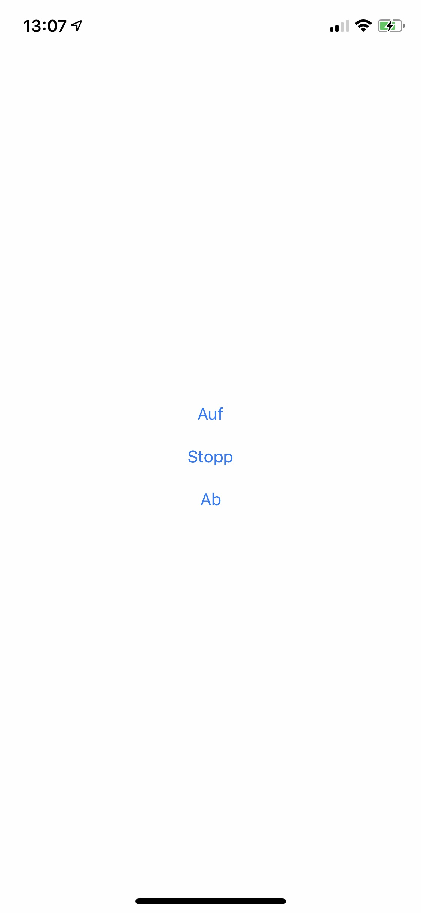

# RollerShutterApp
Authors: Simon Bogutzky

License: [MIT](https://opensource.org/licenses/MIT)

Version: 1.0.0

Document version: 1.0.3 

Date: 12/04/2020

## What is the RollerShutterApp?
The RollerShutterApp is a simple App to communicate with the [RollerShutterFirmware](https://github.com/sbogutzky/RollerShutterFirmware/). I developed it in Visual Studio for Mac. It is a solution for iOS and Android with a shared code base in C#. 

### Example Usage iOS

I create an empty App with the same Bundle Identifier "RollerShutter" in XCode and deploy it with automatic signing. Then I have to verify my development in the settings on the iPhone. After that I can deploy the real app from Visual Studio for Mac.

For now you have to change the IP address of the RollerShutter web server in the source code of the platform code.

```
private readonly RollerShutterManager _manager = new RollerShutterManager("192.168.2.56");
```

{:width="200px"}

*German Interface on the iPhone X*

## Author and Contribution
As by the License this is free software released by the Simon Bogutzky. The author (Simon Bogutzky) welcomes external contributors to freely use and extend this software. If you need some help, please write an [issue](https://github.com/sbogutzky/RollerShutterApp/issues).
